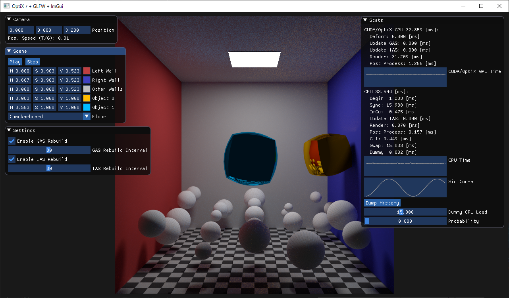

# OptiX Utility



[OptiX](https://developer.nvidia.com/optix)はOptiX 7以降[Direct X Raytracing (DXR)](https://microsoft.github.io/DirectX-Specs/d3d/Raytracing.html)にそっくりなローレベル指向なAPIになりました。<!--
-->細かいところに制御が効く一方で、何をするにも煩雑なセットアップコードを書く必要が出てきました。<!--
-->このOptiX Utilityは細かい制御性はできる限り保持したまま定形処理になりがちな部分を隠蔽したクラス・関数を提供することを目的としています。

[OptiX](https://developer.nvidia.com/optix) changes its form since OptiX 7 into low-level oriented API like [Direct X Raytracing (DXR)](https://microsoft.github.io/DirectX-Specs/d3d/Raytracing.html).
It provides fine-level controllability but requires the user to write troublesome setup code to do anything.
The purpose of this OptiX Utility is to provide classes and functions which encapsulates parts which tend to be boilerplate code while keeping fine controllability.

- cuda_util.h, cuda_util.cpp \
  このCUDAユーティリティはCUDAのbufferやarray、そしてカーネルの実行のためのクラス・関数を提供しています。\
  現在のOptiXはCUDAに基づいたAPIになっているため、ユーザーはOptiXのコードと併せて頻繁に純粋なCUDAのコードも扱う必要があります。\
  これにはOptiX関連のコードは含まれません。\
  This CUDA Utility provides classes and functions for CUDA buffer, CUDA array creation and CUDA kernel execution.
  OptiX is now CUDA-centric API, so the user often needs to manage pure CUDA code along with OptiX code.\
  This doesn't contain any OptiX-related code.
- optix_util.h, optix_util_private.h, optix_util.cpp\
  optix_util.hはOptiXのオブジェクトをホスト側で管理するためのAPIを公開し、デバイス側の関数ラッパーも提供しています。\
  これは上記CUDAユーティリティに依存しています。\
  optix_util.h exposes API to manage OptiX objects on host-side and provides device-side function wrappers as well.\
  This depends on the CUDA Utility above.

## Code example
### Host-side
OptiX UtilityはシェーダーバインディングテーブルのセットアップといったOptiXカーネルを実行するまでに必要な面倒な手続きを可能な限り隠蔽します。

OptiX utility hides troublesome procedures like setting up shader binding table required to execute OptiX kernels as much as possible.
```cpp
// Create an OptiX context from a CUDA context (Driver API).
optixu::Context optixContext = optixu::Context::create(cuContext);

// Create a pipeline and associated programs (groups) then link the pipeline.
optixu::Pipeline pipeline = optixContext.createPipeline();
pipeline.setPipelineOptions(6, 2, "plp", sizeof(PipelineLaunchParameters),
                            false, OPTIX_TRAVERSABLE_GRAPH_FLAG_ALLOW_ANY,
                            OPTIX_EXCEPTION_FLAG_STACK_OVERFLOW | OPTIX_EXCEPTION_FLAG_TRACE_DEPTH |
                            OPTIX_EXCEPTION_FLAG_DEBUG,
                            OPTIX_PRIMITIVE_TYPE_FLAGS_TRIANGLE);
optixu::Module module = pipeline.createModuleFromPTXString(ptx, OPTIX_COMPILE_DEFAULT_MAX_REGISTER_COUNT,
                                                           OPTIX_COMPILE_OPTIMIZATION_DEFAULT, OPTIX_COMPILE_DEBUG_LEVEL_LINEINFO);
optixu::ProgramGroup rayGenProgram = pipeline.createRayGenProgram(module, RT_RG_NAME_STR("pathtracing"));
// ...
optixu::ProgramGroup hitProgramGroup = pipeline.createHitProgramGroup(module, RT_CH_NAME_STR("pathtracing"));
// ...
pipeline.setMaxTraceDepth(2);
pipeline.link(OPTIX_COMPILE_DEBUG_LEVEL_FULL, false);

// Create materials.
optix::Material defaultMat = optixContext.createMaterial();
defaultMat.setHitGroup(RayType::Primary, hitProgramGroup);
// ...
defaultMat.setUserData(...);

// Create a scene.
optixu::Scene scene = optixContext.createScene();

// Create geometry instances (triangle mesh or user-defined custom primitives).
optixu::GeometryInstance geomInst0 = scene.createGeoometryInstance();
cudau::TypedBuffer<Vertex> vertexBuffer;
cudau::TypedBuffer<Triangle> triangleBuffer;
// ...
geomInst0.setVertexBuffer(&vertexBuffer);
geomInst0.setTriangleBuffer(&triangleBuffer);
geomInst0.setUserData(...);
geomInst0.setNumMaterials(1, nullptr);
geomInst0.setGeometryFlags(0, OPTIX_GEOMETRY_FLAG_NONE);
geomInst0.setMaterial(0, 0, defaultMat);

OptixAccelBufferSizes asMemReqs;
cudau::Buffer asBuildScratchMem;

// Create geometry acceleration structures.
optixu::GeometryAccelerationStructure gas0 = scene.createGeometryAccelerationStructure();
gas0.setConfiguration(false, true, true); // Builder preference.
gas0.setChild(geomInst0);
gas0.setChild(geomInst1);
gas0.setChild(...);
optixu::GeometryAccelerationStructure gas1 = scene.createGeometryAccelerationStructure();
// ...
cudau::Buffer gas0Mem;
gas0.prepareForBuild(&asMemReqs);
// ...
OptixTraversableHandle gas0Handle = gas0.rebuild(cuStream, gas0Mem, asBuildScratchMem);

// Create instances.
optixu::Instance inst0 = scene.createInstance();
inst0.setGAS(gas0);
inst0.setTransform(...);
optixu::Instance inst1 = scene.createInstance();
// ...

// Create instance acceleration structures.
optixu::InstanceAccelerationStructure ias0 = scene.createInstanceAccelerationStructure();
ias0.setConfiguration(false, true, true); // Builder preference.
ias0.setChild(inst0);
ias0.setChild(inst1);
ias0.setChild(...);
optixu::InstanceAccelerationStructure ias1 = scene.createInstanceAccelerationStructure();
// ...
cudau::Buffer ias0Mem;
ias0.prepareForBuild(&asMemReqs);
// ...
OptixTraversableHandle ias0Handle = ias0.rebuild(cuStream, instBuffer, ias0Mem, asBuildScratchMem);

// Allocate a shader binding table.
cudau::Buffer shaderBindingTable;
size_t sbtSize;
scene.generateShaderBindingTableLayout(&sbtSize);
// ...

// Associate the pipeline and the scene/shader binding table.
pipeline.setScene(scene);
pipeline.setHitGroupShaderBindingTable(shaderBindingTable);

// Setup pipeline launch parameters and allocate memory for it on the device.
PipelineLaunchParameter plp;
// ...
CUdeviceptr plpOnDevice;
cuMemAlloc(&plpOnDevice, sizeof(plp));

// Launch the pipeline!
cuMemcpyHtoDAsync(plpOnDevice, &plp, sizeof(plp), cuStream);
pipeline.launch(cuStream, plpOnDevice, width, height, 1);
//...
```

### Device-side
OptiX Utilityはペイロードのパッキングを簡単にしたりカーネル間通信における型の不一致を回避するため、デバイス側の組み込み関数のラッパーを提供しています。

OptiX utility provides template wrapper for device-side builtin functions to ease packing of payloads and to avoid type incosistency for inter-kernel communications.
```cpp
#define SearchRayPayloadSignature PCG32RNG, SearchRayPayload*
#define VisibilityRayPayloadSignature float
// ...
CUDA_DEVICE_KERNEL void RT_RG_NAME(pathtracing)() {
    // ...
    SearchRayPayload* payloadPtr = &payload;
    while (true) {
        // ...
        optixu::trace<SearchRayPayloadSignature>(
            traversable, origin, direction,
            0.0f, FLT_MAX, 0.0f, 0xFF, OPTIX_RAY_FLAG_NONE,
            RayType_Search, NumRayTypes, RayType_Search,
            rng, payloadPtr);
        // ...
    }
    // ...
}
// ...
CUDA_DEVICE_KERNEL void RT_CH_NAME(shading)() {
    auto sbtr = optixu::getHitGroupSBTRecordData();
    // ...
    PCG32RNG rng;
    SearchRayPayload* payload;
    optixu::getPayloads<SearchRayPayloadSignature>(&rng, &payload);
    // ...
    {
        // ...
        float visibility = 1.0f;
        optixu::trace<VisibilityRayPayloadSignature>(
            traversable, p, shadowRayDir, 0.0f, dist * 0.999f, 0.0f, 0xFF, OPTIX_RAY_FLAG_NONE,
            RayType_Visibility, NumRayTypes, RayType_Visibility,
            visibility);
        // ...
    }
    // ...
    optixu::setPayloads<SearchRayPayloadSignature>(&rng, nullptr);
}
// ...
```

## 動作環境 / Confirmed Environment
現状以下の環境で動作を確認しています。\
I've confirmed that the program runs correctly on the following environment.

* Windows 10 (1909) & Visual Studio 2019 (16.6.3)
* Core i9-9900K, 32GB, RTX 2070 8GB
* NVIDIA Driver 451.48

動作させるにあたっては以下のライブラリが必要です。\
It requires the following libraries.

* CUDA 11.0
* OptiX 7.1.0 (requires Maxwell or later generation NVIDIA GPU)

## ライセンス / License
Released under the Apache License, Version 2.0 (See LICENSE.md)

----
2020 [@Shocker_0x15](https://twitter.com/Shocker_0x15)
